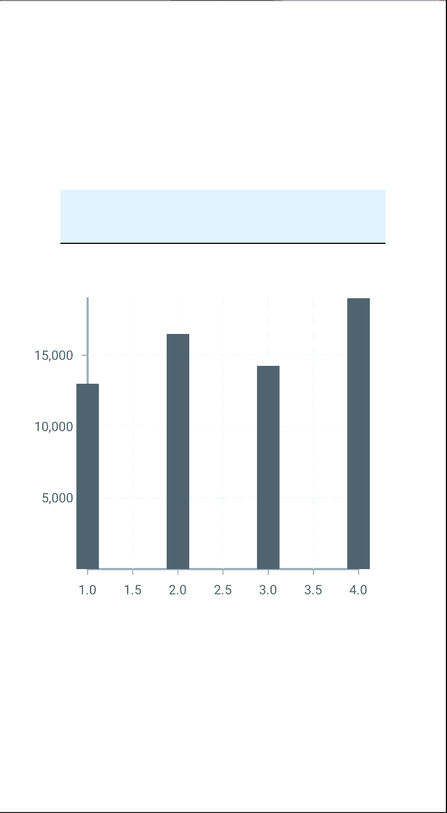
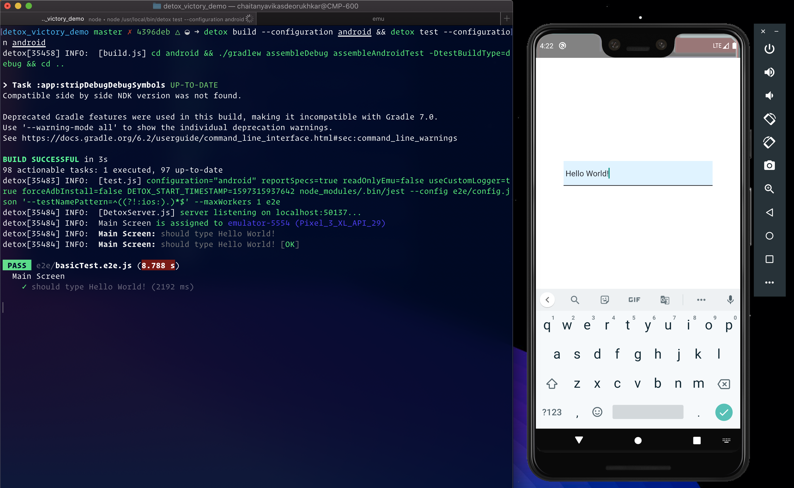
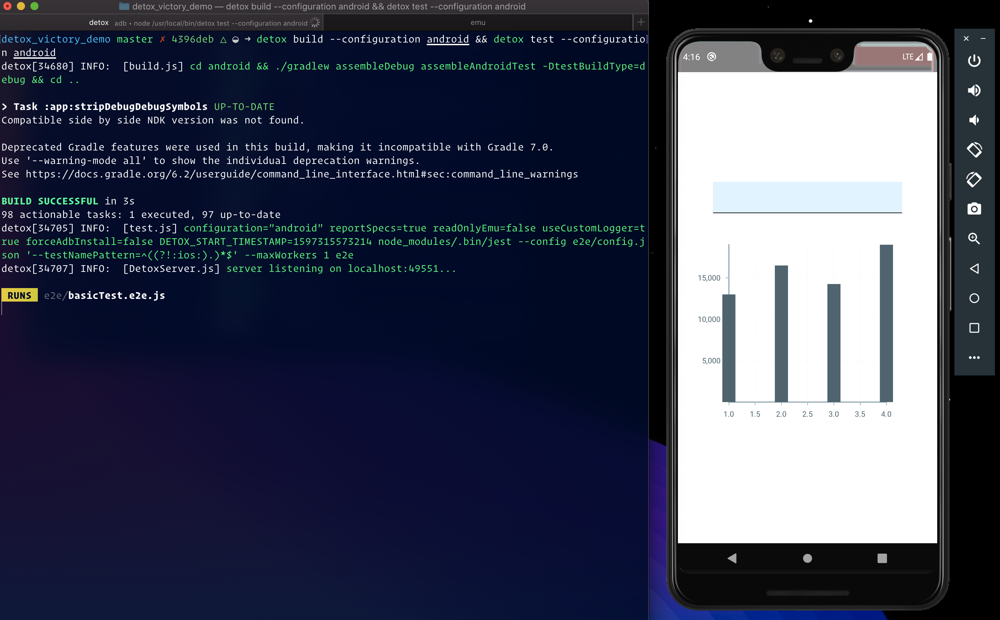
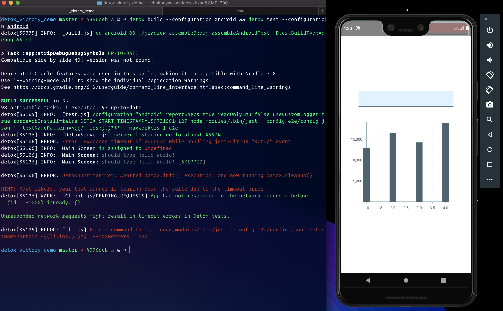

1. [What is this for?](#intro?)
2. [Setup](#detox-setup)
3. [How to run Detox successfully](#detox-success)
4. [How to hang Detox](#detox-hang)

## What is this for? 

To demonstrate that [wix/Detox](https://github.com/wix/Detox) tests hang if we're using [FormidableLabs/victory-native](https://github.com/FormidableLabs/victory-native)

## Setup 

1. Install detox cli using `npm install -g detox-cli`
2. Create an Android emulator and replace `YOUR_EMULATOR_NAME` in `.detoxrc.json` with the name of your emulator
3. Run `yarn` to install dependencies
4. Run `npx react-native run-android` to run the app. You should see this screen 

## How to run Detox **successfully** 

1. In your local, remove the `<Chart />` component and it's import statement `import Chart from './Chart';` entirely from `src/App.js`
2. Run `detox build --configuration android && detox test --configuration android`
3. You should see the test **pass** like this 

## How to **hang** Detox 

1. In your local, make sure you have the `<Chart />` component in `src/App.js`
2. Run `detox build --configuration android && detox test --configuration android`
3. You should see the test **hang** like this 
4. And eventually **fail** like this

